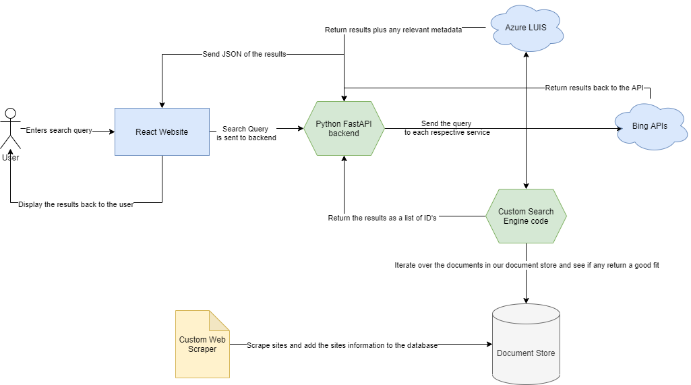

# JusticeBytes
ShellHacks 2020 - A search engine for social justice

Developed with ❤ by:
* Anthony Hevia - Fullstack/DevOps
* Komila Kebolo - ML/UX
* Dylan Ocha - Backend
* Adam Fernandes - Web Scraping / Backend

## Overview

## Tools & Technologies
* [Postman](https://www.postman.com/) for API testing
* [Python3]() for the backend
* [Node.js]() & [React]() for the frontend
* [Docker]() for deployments

## References
Here is a non-ranked, non-exhaustive list of all the resources we used to bring JusticeBytes to life.
* https://davidmathlogic.com/colorblind/#%23D81B60-%231E88E5-%23FFC107-%23004D40
* https://baseweb.design/
* https://myvocabulary.com/word-list/politicsvocabulary/
* https://microsoft.github.io/frontend-bootcamp/
* https://medium.com/@chathuranga94/managing-global-state-with-reacts-hooks-context-api-9b9f781d8a3f
* https://vegibit.com/rendering-a-list-with-react/
* https://reactjs.org/docs/components-and-props.html
* https://mherman.org/blog/dockerizing-a-react-app/
* https://fireship.io/lessons/docker-basics-tutorial-nodejs/

